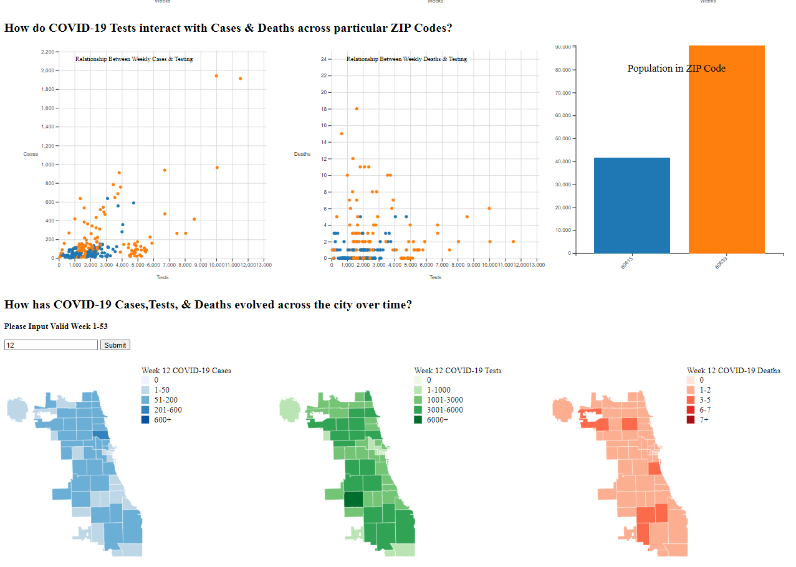
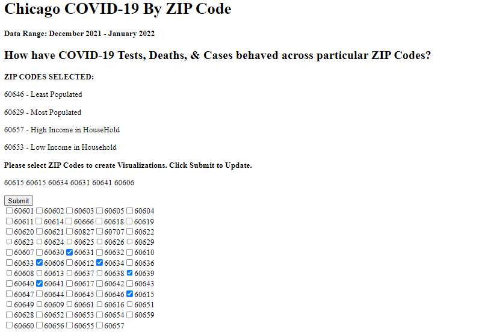
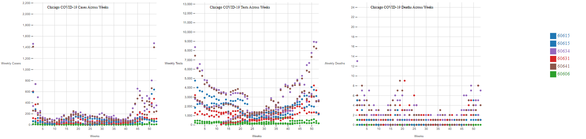
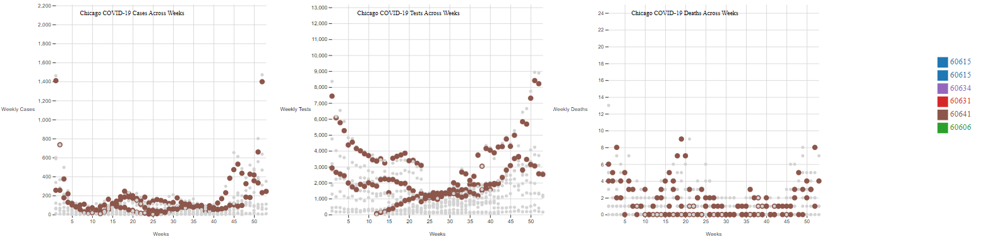
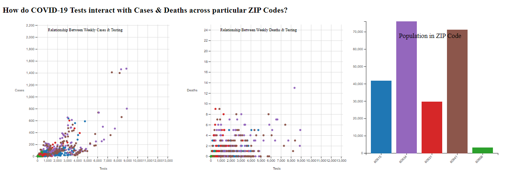
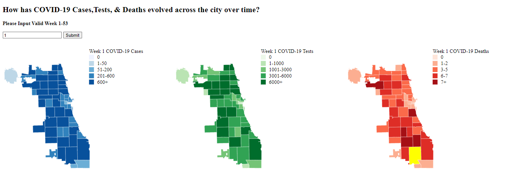
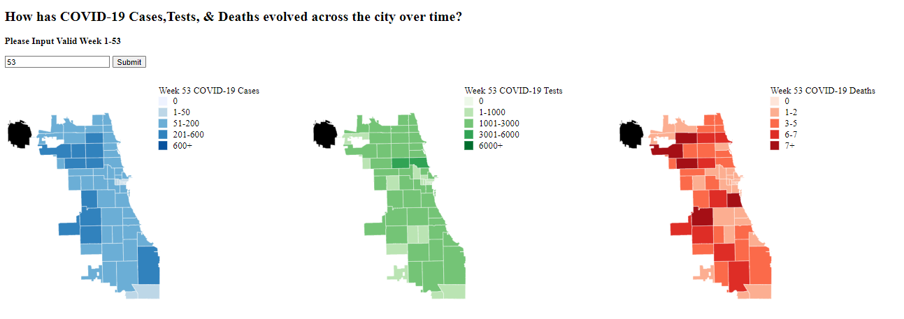

# CS424 - Final Project 

## Introduction
The data set that was selected for this project was from the COVID-19 Cases, Tests, and Deaths by ZIP Code database. This database records COVID-19 information from all of Chicago's ZIP Codes. The dataset has 21 columns and has information dating back to January 1st, 2021. There was no need to limit the amount of data due to how the data was being collected by the city. Normally, acquiring the entirety of data from a database and visualizing it would be challenging especially with Obervable's 50MB file attachment limit. However, the data was collected in a weekly manner, which reduces the amount of data being collected and combined with how recent the data has been collected, makes it easier to work with. This data portal is no longer adding new weeks. There are 53 weeks worth of data from this data.

___
## Data Irregularities & Filtering

The database did have some peculiarities with blank data sections for Weekly Cases and other columns. Those were filtered out from analysis. The database did also have some "Unknown" ZIP Codes. This was unusual considering how the data is being collected based off of ZIP Codes. I suspect this was a result of the city losing track of where exactly the data was taken from or perhaps the testing location was not fixed. These were filtered out.

Another peculiarity of the dataset is that some values were deliberately set to 0. The city of Chicago made the decision to go and deliberately set values like weekly cases, tests, and deaths to 0 in instances in which this may not be the case. They chose to zero out values below 5. They did this specifically for the privacy of individuals as since their ZIP Code is shown, it may be possible to locate where these individuals may be from. However, this does mean that the data's accuracy is impacted by this decision.
___
## Data Considerations

There were however, some issues with the COVID-19 Data that I was unable to resolve due to vagueness. This resulted in me not being able to feasibly create a line graph with time as an attribute to see progression. A line graph specifically was impossible to make due to how the city created the data. In the database, data for each ZIP Code is given out on a weekly basis. However, numerous ZIP Codes have repeated entries in a single week with different values. The notable difference in time is that the start and end dates are one day apart. For instance a ZIP Code may have three entries for week 53 but only two entries for week one.

However, both entries still have a week's worth of data each. This resulted in ambiguity of how these data interact. Aggregation was ruled out simply due to the fact that the time periods that the data was being collected from ZIP is overlapping and as a result, we do not know how the data would interact throughout the columns due to the overlap.

This would cause issues in data involving percentages and also rates as manipulating those data values would lead to inaccurate results.

As such, it was decided that a scatterplot would be a better solution to address multiple entries in a single week.
___
## Questions

In order to investigate the data , I considered the main domain question: How has COVID-19 spread throughout the city of Chicago since the data began being collected? 

The following Data Questions were then created: What are the trends for weekly cases,tests, and deaths across 52 weeks for each of the selected ZIP Codes? What is the population of each ZIP Code? How do weekly cases and deaths correlate with weekly tests throughout the weeks?
How exactly do cases,deaths and testing behave for a week throughout the city?
___
## Website

A Website with the Replit IDE was used in creating a website.
The website included data visualizations aimed at answering the earlier questions.

The link to the website is: https://cs424.jusstanly.repl.co/

*Website Interface*

___
## Selection of ZIP Codes
In the website, a person can select as many ZIP Codes as they wish from a checklist option of all of the Chicago ZIP Codes. Once selection of ZIP Codes are complete, the visualizations based on the selected ZIP Codes would become generated. Typically it is recommended that one does not select more than five ZIP Codes due to it being difficult to differentiate between data points. However, it is possible to select as many ZIP Codes as one wishes. Then the Submit button can be clicked to generate visualizations based on those codes.

*User Selection Interface*
___
## Generation of Visualizations
After this is done three scatter plots will be created.
These plots will detail the tests, cases, and deaths for each week for the selected ZIP Codes. A legend will also be provided to show which color is associated with which code. 

*Scatter Plots and Legend*
  
There is an interaction which would allow for filtering of a ZIP Code through highlighting it on the visualization. This can be done in any scatterplot and it would be reflected on the others. This would make it easier to observe trends and also focus on only a particular ZIP Code.
  

*Highlight Feature*

These visualizations would be assisting in answering how cases, deaths, and testing behaved for particular ZIP Codes throughout the weeks.

  
Two more scatter plots were generated which were used to see the relationship between testing and deaths or cases. A bar chart was created to see the population of the selected ZIP Codes and consider its role in the data. The scatter plots have the same highlight feature as the first three scatter plots.

*Testing Scatter plots and Population Bar Chart*

  
Another set of visualization was created with the assistance of user input. An option to type in a number between 1-53 would be shown and when the Submit button is selected, three maps would be generated. The numbers are for the possible weeks that are in the data.

Three maps of the city of Chicago will be shown along with ZIP Codes boundaries shown. These maps are choloropeth maps. They show the extent and the depth of the COVID-19 cases, testing, and deaths throughout the city for that particular week that was inputted. Legends for each map are provided to show the scale of each color.
Due to the issue of their being multiple values for each ZIP Code for a partilcuar week, a decision was made to select the largest value out of a ZIP Code for a selected week. This was only done for the data if COVID-19 Cases, Tests, and Deaths.

*Chloropeth Maps of the City of Chicago for COVID-19 Data*
  

There is an interesting behavior when the city does not have data for a particular ZIP Code for a particular week. This can be observed when week 53 is typed in and submitted. The ZIP Code without data becomes blacked out to indicate that it has no data and is unknown. This can be useful to identify limitations in the analysis of certain ZIP Codes.

*Chloropeth Maps when data is not available for ZIP Code*
  
___
## Conclusions
Overall, data visualizations supported conjectures such as when there are more cases, there would also be more testing and deaths. However, the number deaths do not necessarily seem to be entirely based on the population of a ZIP Code. There have been iiregualrities that have been shown in which the least populated ZIP Code have had more deaths than the most populated in a particular week. This means that these visualizations can be utilized to expose abnormal spikes that do not seem to follow typical trends and consider what could have caused that abnormality.

These visualizations also expose the limations of Chicago's data collection methods of the ZIP Code associated with O'Hare International Airport. It could be argued that the number of COVID related cases and testing should be very high at O'Hare. However, with the last sets of visualizations, O'Hare does not seem to be going above the first tier on the scale for any week, even as the rest of the city has spikes in all three categories. 